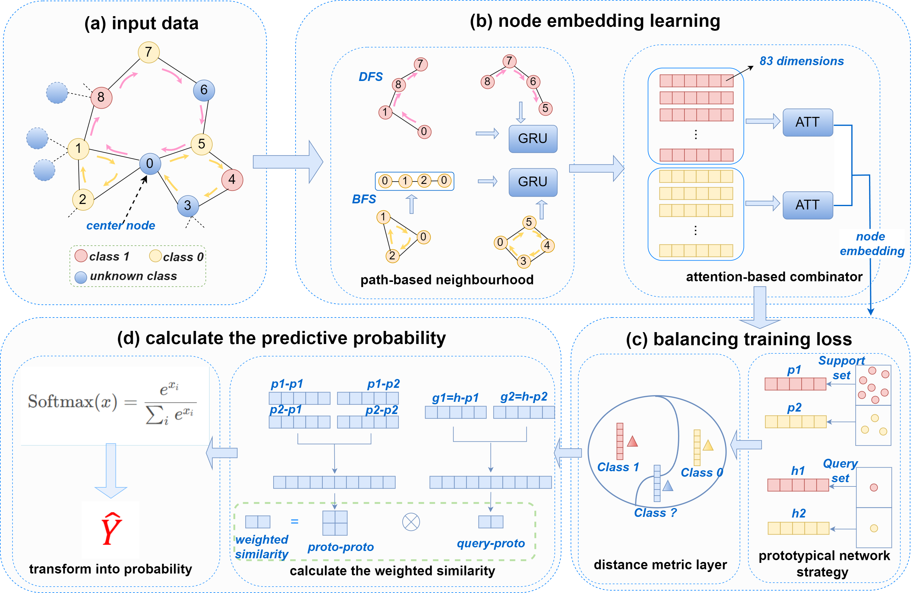

# DPGNNPAM
A deep learning model that integrates path aggregation strategies and prototype-driven mechanisms for effective node classification on biological networks. DPGNNPAM captures both topological and attribute information, improving the prediction of drought-resistant genes in rice.

Below is the algorithm flowchart:

